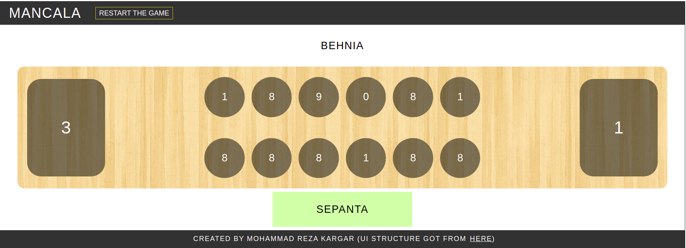

# Mancala Game

## A rule to be consider

When the last stone of a player sits on an empty pit, the player puts his stones and all stones placed in opposite side
of his pit in his big pit. It's my implementation but another implementation may put his opponent's stones in the last
pit.

## How to play

Run the spring boot application from **MancalaApplication** and then go to this address in your browser
http://localhost:8080 or http://localhost:8080/index.html and enjoy Mancala.
  Application automatically create two players named **Behnia** and **Sepanta**. These are names of my sons ;)

## Technology Stack

- [ ] **Spring Boot** for backend and
- [ ]  **Reactjs** for front end. 
  Actually the base structure of ui (not javascript) got from https://paige1381.github.io/Mancala/. It's just 
  because of my time constraints.

## UI source code

It's under this path: src/main/resources/web/mancala-ui

## Improvements

- [ ] Creating users under the fly instead of hard coding
- [ ] Adding security
- [ ] More tests
- [ ] Better UI (Using stones picture beside the numbers)
- [ ] Better message handling at UI side

